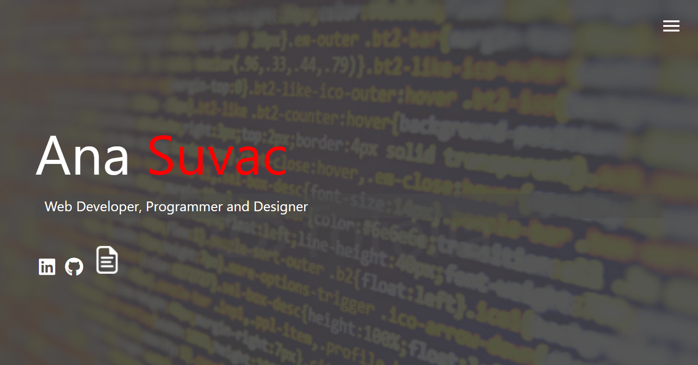
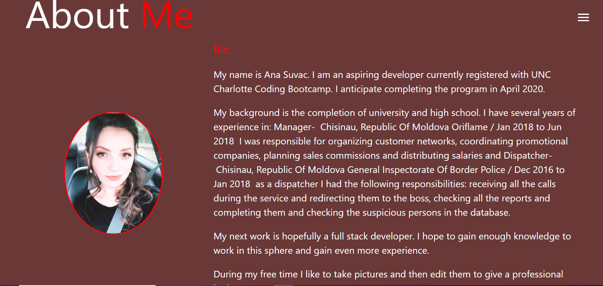
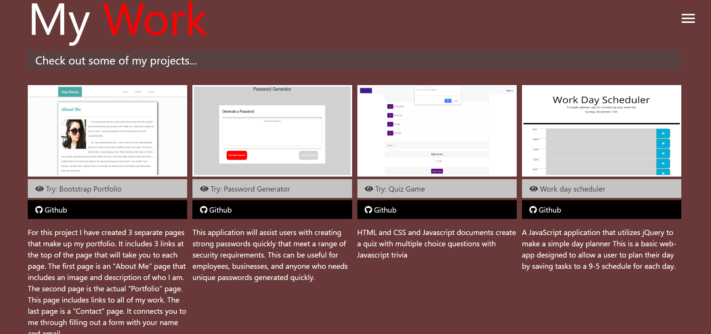

# Homework-16
# Update portfolio 
 

Updated site  have the following content:

My name

Links to my GitHub profile & LinkedIn page as well as my email address and phone number

A link to a PDF of my resume

A list of projects. For each project :

Project title

Link to the deployed version

Link to the GitHub repository

Screenshot of the deployed application..
 
# Links :

 https://annasuvvac.github.io/homework-16/ - WebSite

 https://github.com/Ana199816/homework-16 - GitHub

# Screenshots : 
  

  
 
 
 
  
   
 
 
  
